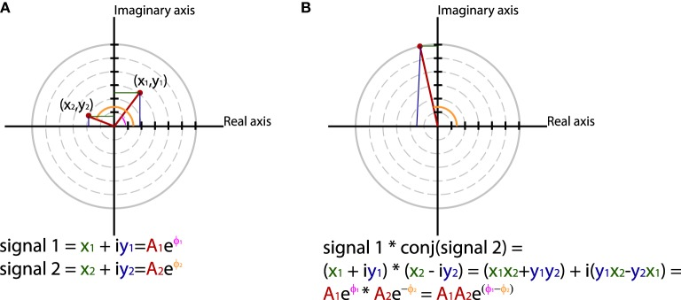
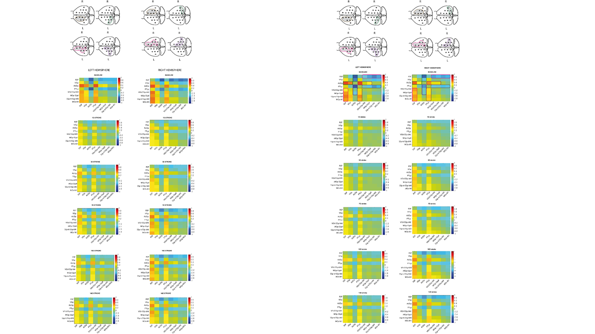

# Imaginary-Coherence-EEG

## 1. Background
### Papers selected: 
### .- Identifying true brain interaction from EEG data using the imaginary part of coherency
Guido Nolte 1, Ou Bai, Lewis Wheaton, Zoltan Mari, Sherry Vorbach, Mark Hallett
Affiliations collapse
Affiliation 1Human Motor Control Section, NINDS, NIH, 10 Center Drive MSC 1428, Bldg 10, Room 5N226, Bethesda, MD 20892-1428, USA. nolteg@ninds.nih.gov
### .- A Tutorial Review of Functional Connectivity Analysis Methods and Their Interpretational Pitfalls
André M. Bastos1,* and Jan-Mathijs Schoffelen2,3,*
1Department of Brain and Cognitive Sciences, The Picower Institute for Learning and Memory, Massachusetts Institute of Technology, Cambridge, MA, USA
2Neurobiology of Language Department, Max Planck Institute for Psycholinguistics, Nijmegen, Netherlands
3Donders Centre for Cognitive Neuroimaging, Donders Institute for Brain, Cognition and Behaviour, Radboud University Nijmegen, Nijmegen, Netherlands
Edited by: Mikhail Lebedev, Duke University, USA
Reviewed by: Karim Jerbi, University of Montreal, Canada; Mingzhou Ding, University of Florida, USA; Craig Geoffrey Richter, Ernst Strüngmann Institute, Germany
*Correspondence: André M. Bastos moc.liamg@sotsabmerdna;
Jan-Mathijs Schoffelen ln.ur.srednod@neleffohcs.naj

### Equations
#### 

#### 

#### 

#### https://pubmed.ncbi.nlm.nih.gov/15351371/

## 2. Output Example
# 


## 3. This is the Motor-Code 
#### [Python 3.7](https://https://www.python.org/) 

```python
# -*- coding: utf-8 -*-
"""
Created on Wed Dec 27 13:31:23 2018

@author: lapi2
"""
from scipy import signal
import matplotlib.pyplot as plt
import numpy as np

"""
500 Hz sampling rate
100 samples/2=50 FFT bins
250 Hz/50 FFT bins≃5 Hz/bin
"""

def nextpow2(i):
    n = 1
    while n < i: n *= 2
    return n


def coherency(sampling_frequency,data):
    nfft = 2^nextpow2(len(data))
    timestep = 0.1
    Fs = sampling_frequency 
    dt = 1/Fs

    nchan, segleng = data.shape # row or nchan = 64 channels, columns or segleng = all sampling points
    t = np.arange(0,segleng/Fs,dt) 

    channels_number = np.arange(0,nchan)

    count = 0
    incount = 1
    j = 0
    k = 250
    window = signal.hann(250)
    frq = np.arange(0,Fs/2)*0.5
    N = len(window)
    positions = np.arange(len(window))
    T = len(window)/Fs

    frq = np.arange(0,Fs/4) # one side frequency range
    Sxy = np.zeros(250, dtype = complex)
    Sxx = np.zeros(250, dtype = complex)
    Syy = np.zeros(250, dtype = complex)
    Coh = np.zeros((nchan,250,nchan), dtype = complex)


    electrode = 0
    TRIO = nchan - 1 
    
    while TRIO > 0:
        
        for index in range(electrode+1,nchan):
            
            while (k < segleng):
                
                s1 = signal.detrend(data[electrode,j:k])
                s2 = signal.detrend(data[index,j:k])
                temp = (s1)*window
                Fx = np.fft.fft(temp)/len(temp)
                temp = (s2)*window        
                Fy = np.fft.fft(temp)/len(temp)
                # Fx = Fx ./ abs(Fx) for PLV
                # Fy = Fy ./ abs(Fy) for PLV
                Sxy += Fx * np.conjugate(Fy)
                Syy += Fy * np.conjugate(Fy)
                Sxx += Fx * np.conjugate(Fx)
                incount += 1
                j += 250
                k += 250
                
        # PLV = Sxy /  # Sxx*Syy
        Sxy_mean = Sxy / incount
        Sxx_mean = Sxx / incount
        Syy_mean = Syy / incount
        coherency_matrix = Sxy_mean / np.sqrt(Sxx_mean*Syy_mean)
        Coh[electrode,:,index] = coherency_matrix;
            
        Sxy = np.zeros(250, dtype = complex)
        Sxx = np.zeros(250, dtype = complex)
        Syy = np.zeros(250, dtype = complex)
        coherency_matrix = np.zeros((250,16), dtype = complex)
        j = 0
        k = 250
        incount = 1
        
    electrode += 1
    TRIO -=  1
    print('TRIO',TRIO)
    return Coh
```
#### You need to incorporate the loading file to the main.py as it fits to your project
## 4. Contact

